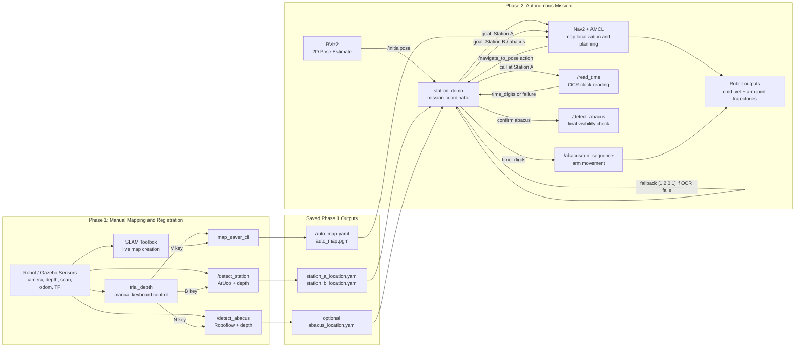

# Phase 1 and Phase 2 Architecture

This document describes the high-level structure of the mapping and autonomous
mission pipeline. It focuses on what each phase starts, which ROS nodes and
services are involved, what robot inputs are used, and when services are called.

## System Overview

The project is split into two main operational phases:

1. Phase 1: manual mapping and station registration.
2. Phase 2: autonomous navigation, clock reading, and abacus manipulation.

Phase 1 creates the persistent inputs used by Phase 2:

- A SLAM map saved as `auto_map.yaml` and `auto_map.pgm`.
- Station A navigation goal saved as `station_a_location.yaml`.
- Station B navigation goal saved as `station_b_location.yaml`.
- Optionally, an abacus-specific navigation goal saved as `abacus_location.yaml`.

By default these files are stored in:

```text
~/mirte_ws/src/cognitive-robot/maps/
```

Phase 2 loads those files, uses Nav2 to localize and plan against the saved map,
then executes the mission sequence:

```text
initial pose -> Station A -> read clock -> Station B/abacus -> arm movement
```

## Block Diagram



### Runtime Architecture Diagram

```text
================================================================================
                    COGNITIVE ROBOT PHASE 1 / PHASE 2 SYSTEM
================================================================================

  +----------------------------- ROBOT / GAZEBO SENSORS -----------------------+
  |                                                                            |
  |  Front color camera        Depth camera          Laser / odom / TF         |
  |  real: /camera/color/      /camera/depth/        /scan, /odom, TF tree     |
  |        image_raw(/compressed) image_raw                                     |
  |  sim : /camera/image_raw                                                    |
  |                                                                            |
  +----------+----------------------+------------------------+------------------+
             |                      |                        |
             |                      |                        |
  +----------v----------+  +--------v---------+    +--------v------------------+
  | COLOR PERCEPTION    |  | DEPTH UTILITIES  |    | MAPPING / NAVIGATION      |
  |                     |  |                  |    |                           |
  | read_time_service   |  | depth_utils.py   |    | slam_toolbox              |
  | - EasyOCR clock     |  | - depth frame    |    | - builds Phase 1 map      |
  | - rotates robot     |  | - camera_info    |    | - saves auto_map.*        |
  |                     |  | - pixel -> 3D    |    |                           |
  | detect_station      |  |                  |    | Nav2 + AMCL               |
  | - ArUco marker      |  +--------+---------+    | - loads saved map         |
  | - Station A/B ID    |           |              | - NavigateToPose action   |
  |                     |           |              | - costmaps/controllers    |
  | detect_abacus       |           |              +-------------+-------------+
  | - Roboflow object   |           |                            |
  | - bbox center       |           |                            |
  +----------+----------+           |                            |
             |                      |                            |
             +----------+-----------+----------------------------+
                        |
                        v
  +----------------------------------------------------------------------------+
  |                          PHASE-SPECIFIC CONTROL                             |
  |                                                                            |
  |  Phase 1: trial_depth                                                       |
  |  - manual keyboard drive                                                    |
  |  - B key -> /detect_station -> station_a/b_location.yaml                    |
  |  - N key -> /detect_abacus  -> abacus_location.yaml                         |
  |  - V key -> map_saver_cli -> auto_map.yaml + auto_map.pgm                   |
  |                                                                            |
  |  Phase 2: station_demo                                                      |
  |  - waits for RViz /initialpose and Nav2 readiness                           |
  |  - navigates to Station A                                                   |
  |  - calls /read_time, falls back to [1, 2, 0, 1] on OCR failure              |
  |  - navigates to Station B or abacus goal                                    |
  |  - calls /abacus/run_sequence and final /detect_abacus check                |
  |                                                                            |
  +-----------------------------+----------------------------------------------+
                                |
                                v
  +----------------------------- ROBOT OUTPUTS --------------------------------+
  |  /mirte_base_controller/cmd_vel or Gazebo cmd_vel                           |
  |  /mirte_master_arm_controller/joint_trajectory                              |
  +----------------------------------------------------------------------------+
```

### Node Communication Diagram

```text
PHASE 1: mapping + station registration

  camera color/depth/info          scan + odom + TF
          |                              |
          v                              v
  +------------------+             +----------------+
  | perception nodes |             | slam_toolbox   |
  |                  |             | live map build |
  | /detect_station  |             +--------+-------+
  | /detect_abacus   |                      |
  +--------+---------+                      |
           ^                                |
           | service calls                  |
           |                                v
  +--------+--------------------------------------------------+
  | trial_depth                                               |
  | - subscribes camera for manual display                    |
  | - publishes velocity commands                             |
  | - calls detection services                                |
  | - transforms camera detections into map frame             |
  | - runs map_saver_cli                                      |
  +--------+----------------------+---------------------------+
           |                      |
           v                      v
  station_a_location.yaml   auto_map.yaml / auto_map.pgm
  station_b_location.yaml
  optional abacus_location.yaml


PHASE 2: autonomous mission

  auto_map.yaml / auto_map.pgm       station/abacus YAML files
              |                              |
              v                              v
  +-------------------------+        +----------------------+
  | Nav2 bringup + AMCL     |        | station_demo         |
  | - map server            |<------>| - mission sequence   |
  | - planner/controller    | action | - service clients    |
  | - costmaps              |        | - fallback time      |
  +-----------+-------------+        +----+------------+----+
              |                           |            |
              v                           |            |
       base cmd_vel                       |            |
                                          |            |
                          +---------------v--+      +--v-------------------+
                          | /read_time       |      | /detect_abacus       |
                          | OCR + scan turn  |      | Roboflow + depth     |
                          +---------------+--+      +----------------------+
                                          |
                                          v
                              +-----------+----------------+
                              | /abacus/run_sequence       |
                              | abacus_manipulation_node   |
                              | arm joint trajectories     |
                              +----------------------------+
```

### Code Structure Diagram

```text
cognitive-robot/
|
|-- cognitive_robot/                         main ROS 2 Python package
|   |
|   |-- launch/
|   |   |-- phase1_gazebo.launch.py          Gazebo mapping + registration
|   |   |-- phase1_real.launch.py            Real robot mapping + registration
|   |   |-- phase2_gazebo.launch.py          Gazebo autonomous mission
|   |   `-- phase2_real.launch.py            Real robot autonomous mission
|   |
|   |-- cognitive_robot/
|   |   |-- plan_nav/
|   |   |   |-- trial_depth.py               Phase 1 manual mapper/register
|   |   |   `-- station_demo.py              Phase 2 mission coordinator
|   |   |
|   |   |-- detect_station_service.py        ArUco station detection service
|   |   |-- detect_abacus_service.py         Roboflow abacus detection service
|   |   |-- read_time_service.py             EasyOCR clock reading service
|   |   |-- depth_utils.py                   shared depth/camera-info logic
|   |   |-- abacus_manipulation_node.py      abacus arm sequence service
|   |   `-- odom_tf_broadcaster.py           real-robot odom->base_link TF
|   |
|   `-- test/                               service/unit tests
|
|-- cognitive_robot_interfaces/              custom service definitions
|   `-- srv/
|       |-- DetectStation.srv
|       |-- DetectAbacus.srv
|       |-- ReadTime.srv
|       `-- RunAbacus.srv
|
|-- maps/                                    saved Phase 1 outputs
|   |-- auto_map.yaml / auto_map.pgm
|   |-- station_a_location.yaml
|   |-- station_b_location.yaml
|   `-- abacus_location.yaml
|
|-- config/                                  SLAM/Nav2 parameter files
|-- gazebo_map_load/                         Gazebo station/world assets
|-- commands_documents/                      run/debug command notes
`-- local_script_tests/                      offline perception experiments
```

## Phase 1: Manual Mapping and Station Registration

### Purpose

Phase 1 is the data-collection and environment-registration phase. The robot is
manually driven around the environment while SLAM Toolbox builds a map. The user
also drives the robot near Station A and Station B and triggers station
detection so their positions can be transformed into the SLAM map frame and
saved as YAML files.

### Launch Files

Gazebo:

```bash
ros2 launch cognitive_robot phase1_gazebo.launch.py
```

Real robot:

```bash
ros2 launch cognitive_robot phase1_real.launch.py
```

### Main Nodes Started in Phase 1

| Node or process | Role |
| --- | --- |
| Gazebo / MIRTE robot simulation | Provides the simulated robot, sensors, and world for Gazebo runs. |
| `slam_toolbox` | Builds the live SLAM map while the robot is manually driven. |
| `rviz2` | Visualizes the map, TF, laser scan, and robot pose. |
| `detect_station_service` | Detects ArUco station markers and returns station identity plus 3D position. |
| `detect_abacus_service` | Detects the abacus using Roboflow/YOLO-style inference and depth. |
| `read_time_service` | Available during Phase 1, although the main Phase 1 task is mapping and registration. |
| `trial_depth` | Manual teleoperation node; calls detection services and saves station/map files. |

### Robot Inputs Used in Phase 1

| Input | Used by | Purpose |
| --- | --- | --- |
| Front color camera | `trial_depth`, `detect_station_service`, `detect_abacus_service`, `read_time_service` | Display, ArUco detection, abacus detection, OCR. |
| Depth camera | `detect_station_service`, `detect_abacus_service` | Measures distance and 3D position of detected objects. |
| Camera info | `detect_station_service`, `detect_abacus_service` | Camera intrinsics for projecting depth pixels into metric 3D positions. |
| TF tree | `trial_depth` | Converts detections from camera frame into the SLAM `map` frame. |
| Laser/scan and odometry | SLAM Toolbox | Builds the map and estimates robot pose during mapping. |
| Keyboard input | `trial_depth` | Manual control and trigger commands. |

On the real robot, the launch file starts the perception services on the
compressed color stream:

```text
/camera/color/image_raw/compressed
```

`read_time_service`, `detect_station_service`, and `detect_abacus_service`
select their subscription message type from the configured topic. If the topic
ends in `/compressed`, they subscribe to `sensor_msgs/CompressedImage` and
decode the JPEG payload with OpenCV. Otherwise, they subscribe to raw
`sensor_msgs/Image`.

`trial_depth` still uses the raw color topic for its live manual-driving display
in Phase 1. The service calls used by `trial_depth` can use compressed color
frames independently.

### Phase 1 Keyboard Controls

The `trial_depth` node reads keyboard input from the OpenCV display window.

| Key | Action |
| --- | --- |
| `W` / `S` | Drive forward / backward. |
| `A` / `D` | Strafe left / right. |
| `Q` / `E` | Rotate left / right. |
| `X` | Stop the robot. |
| `B` | Call `/detect_station` and save Station A or Station B location. |
| `N` | Call `/detect_abacus` and save abacus location. |
| `V` | Save the SLAM map and quit. |
| `ESC` | Quit without saving the map. |

### Station Registration Flow

When the user presses `B`, `trial_depth` does the following:

1. Stops the robot.
2. Calls `/detect_station`.
3. Receives the station marker ID, station name, distance, 3D camera-frame
   position, and marker yaw.
4. Looks up the TF transform from the camera frame to the SLAM `map` frame.
5. Transforms the detected station point into map coordinates.
6. Computes a `destination_pose`, which is a navigation goal in front of the
   station facing the station.
7. Saves or overwrites:

```text
station_a_location.yaml
station_b_location.yaml
```

The saved station YAML contains both the detected station position and the
computed robot navigation goal:

```yaml
map_pose:
  frame_id: "map"
  x: ...
  y: ...
  z: ...

destination_pose:
  frame_id: "map"
  x: ...
  y: ...
  z: ...
  yaw_rad: ...
```

### Abacus Registration Flow

When the user presses `N`, `trial_depth` does the following:

1. Stops the robot.
2. Calls `/detect_abacus`.
3. Receives confidence, bounding box center, object size, distance, and
   camera-frame metric offsets.
4. Transforms the abacus point into the SLAM `map` frame.
5. Computes a navigation goal in front of the abacus.
6. Saves or overwrites:

```text
abacus_location.yaml
```

In Phase 2, `station_demo` prefers `abacus_location.yaml` for the Station B
goal if it exists. If it does not exist, it falls back to
`station_b_location.yaml`.

### Map Saving Flow

When the user presses `V`, `trial_depth` runs Nav2 map saver:

```bash
ros2 run nav2_map_server map_saver_cli -f <map_dir>/<map_name>
```

For the default setup, this creates:

```text
auto_map.yaml
auto_map.pgm
```

These files are the map input for Phase 2.

## Phase 2: Autonomous Navigation and Task Execution

### Purpose

Phase 2 consumes the map and station YAML files generated in Phase 1. It uses
Nav2 and AMCL to localize the robot on the saved map, drives to Station A,
calls the clock-reading service, then drives to Station B or the abacus location
and runs the arm sequence.

### Launch Files

Gazebo:

```bash
ros2 launch cognitive_robot phase2_gazebo.launch.py
```

Real robot:

```bash
ros2 launch cognitive_robot phase2_real.launch.py
```

To use a non-default map:

```bash
ros2 launch cognitive_robot phase2_gazebo.launch.py map:=/full/path/to/map.yaml
```

### Main Nodes Started in Phase 2

| Node or process | Role |
| --- | --- |
| Nav2 bringup | Loads the saved map, runs AMCL localization, costmaps, planners, and controllers. |
| `rviz2` | Visualizes map, costmaps, scan alignment, robot pose, and navigation goals. |
| `detect_abacus_service` | Provides `/detect_abacus` for abacus confirmation and optional location logic. |
| `read_time_service` | Provides `/read_time`, called at Station A after navigation completes. |
| `abacus_manipulation_node` | Provides `/abacus/run_sequence` on the real robot launch. |
| `station_demo` | Main autonomous mission node. Loads station YAML files and controls the sequence. |

The Gazebo Phase 2 launch also starts `detect_station_service`, because it uses
the same perception stack as Phase 1. The real robot Phase 2 launch currently
does not start `detect_station_service` because the autonomous mission does not
need station detection during Phase 2 and disabling it reduces camera bandwidth.

### Phase 2 Inputs

| Input | Source | Consumer |
| --- | --- | --- |
| `auto_map.yaml` / `auto_map.pgm` | Phase 1 map save | Nav2 map server and AMCL. |
| `station_a_location.yaml` | Phase 1 station registration | `station_demo`. |
| `station_b_location.yaml` | Phase 1 station registration | `station_demo` fallback for Station B. |
| `abacus_location.yaml` | Optional Phase 1 abacus registration | Preferred Station B/abacus goal for `station_demo`. |
| Initial pose estimate | User in RViz2 | AMCL and `station_demo` start gate. |
| Compressed color camera stream on real robot | Robot | `/read_time` and `/detect_abacus`. |
| Raw color camera stream in Gazebo | Gazebo | `/read_time`, `/detect_abacus`, and Gazebo-only `/detect_station`. |
| Raw depth stream | Robot or Gazebo | `/detect_abacus`; `/detect_station` when that service is launched. |
| Nav2 action server | Nav2 | `station_demo` sends navigation goals. |

### Camera Compression and Bandwidth

The real robot launches use compressed color images for the perception services:

```text
/camera/color/image_raw/compressed
```

This is a bandwidth fix for running perception over WiFi. Raw RGB camera frames
are large, and Phase 2 also needs Nav2 traffic, laser scans, TF, odometry, and
selected depth frames to arrive reliably. The compressed topic keeps OCR and
object detection fed with color images while leaving more bandwidth for
navigation.

The compression handling lives inside the perception nodes:

- `read_time_service`
- `detect_station_service`
- `detect_abacus_service`

Each node reads its `camera_topic` parameter. Topics ending in `/compressed`
use `sensor_msgs/CompressedImage` and `cv2.imdecode(...)`; other topics use raw
`sensor_msgs/Image` through `CvBridge`. This means the same service code works
with real robot compressed color topics and Gazebo raw color topics.

Depth is not compressed in this architecture. `DepthCameraMixin` subscribes to
the raw depth image and camera info so detections can be converted from pixels
into metric 3D positions. Because raw depth is expensive over WiFi, the real
Phase 2 launch only starts the depth-using services that the mission actually
needs.

Current real-robot Phase 2 bandwidth choices:

- `/read_time` uses compressed color only.
- `/detect_abacus` uses compressed color plus raw depth, because final abacus
  confirmation and metric position depend on depth.
- `/detect_station` is disabled in `phase2_real.launch.py`, because
  `station_demo` does not call it during the autonomous mission and it would
  otherwise keep another raw depth subscription active.
- Gazebo Phase 2 can still launch `/detect_station`, because simulated topics
  are local and do not have the same WiFi bottleneck.

### Phase 2 Mission Timeline

The `station_demo` node executes this sequence:

1. Load `station_a_location.yaml`.
2. Try to load `abacus_location.yaml` for the Station B/abacus goal.
3. If `abacus_location.yaml` is unavailable or incomplete, load
   `station_b_location.yaml` instead.
4. Wait for the Nav2 `/navigate_to_pose` action server.
5. Wait for the user to set the 2D Pose Estimate in RViz2.
6. Wait for AMCL to settle.
7. Wait for `/read_time` service.
8. Wait for `/detect_abacus` service.
9. Send a Nav2 goal to Station A.
10. After reaching Station A, call `/read_time`.
11. If time reading succeeds, use the returned four digits.
12. If time reading fails, use the fallback time `[1, 2, 0, 1]`, representing
    `12:01`.
13. Send a Nav2 goal to Station B or the abacus location.
14. Call `/abacus/run_sequence` with the four time digits.
15. Call `/detect_abacus` to confirm whether the abacus is visible.

The key redundancy is step 12: failure to read the clock does not stop the
mission by default. The robot continues using the default time digits.

## ROS Services

### `/detect_station`

Provided by:

```text
detect_station_service
```

Service type:

```text
cognitive_robot_interfaces/srv/DetectStation
```

Request:

```text
empty
```

The request is empty because the service uses the latest cached camera and
depth frames.

Response:

| Field | Meaning |
| --- | --- |
| `detected` | True if an ArUco marker was found. |
| `marker_id` | ArUco marker ID. |
| `station_name` | Human-readable station name, for example `Station A`. |
| `distance_m` | Depth-camera distance to the marker. |
| `x_m`, `y_m`, `z_m` | Marker position relative to the camera frame. |
| `yaw` | Estimated marker horizontal rotation in radians. |

Called during:

- Phase 1 only, when the user presses `B` in `trial_depth`.

Used to produce:

- `station_a_location.yaml`
- `station_b_location.yaml`

### `/detect_abacus`

Provided by:

```text
detect_abacus_service
```

Service type:

```text
cognitive_robot_interfaces/srv/DetectAbacus
```

Request:

```text
empty
```

Response:

| Field | Meaning |
| --- | --- |
| `confidence` | Roboflow detection confidence. `0.0` means no valid detection. |
| `x`, `y` | Pixel center of the detected abacus bounding box. |
| `bbox_width`, `bbox_height` | Bounding box dimensions in pixels. |
| `distance_m` | Depth-camera distance to the abacus. |
| `x_m`, `y_m` | Metric offset of abacus relative to camera frame. |

Called during:

- Phase 1 when the user presses `N` in `trial_depth`.
- Phase 2 after reaching Station B, as a final abacus visibility check.
- Phase 2 startup waits for this service before beginning the mission.

Used to produce:

- `abacus_location.yaml` during Phase 1.

### `/read_time`

Provided by:

```text
read_time_service
```

Service type:

```text
cognitive_robot_interfaces/srv/ReadTime
```

Request:

```text
empty
```

The request is empty because the robot is expected to already be positioned at
the clock station before the service is called.

Response:

| Field | Meaning |
| --- | --- |
| `found` | True if OCR detected a valid time string. |
| `time_digits` | Four digits from left to right. Example: `14:32` becomes `[1, 4, 3, 2]`. Empty when `found` is false. |

Called during:

- Phase 2 after Nav2 reports that the robot reached Station A.

Internal behavior:

1. Waits for a camera frame.
2. Runs OCR on the current image.
3. If no valid time is found, rotates the robot in a zig-zag scan pattern and
   retries.
4. Stops when a valid time is found or when the maximum number of iterations is
   reached.
5. Returns `found=true` with four digits on success, or `found=false` on
   failure.

Robot inputs and outputs:

| Interface | Direction | Purpose |
| --- | --- | --- |
| Camera topic | Subscribe | Reads clock images. |
| `cmd_vel` topic | Publish | Rotates the robot while scanning for the clock. |

### `/abacus/run_sequence`

Provided by:

```text
abacus_manipulation_node
```

Service type:

```text
cognitive_robot_interfaces/srv/RunAbacus
```

Request:

| Field | Meaning |
| --- | --- |
| `time_digits` | Four digits to represent on the abacus, for example `[1, 4, 3, 2]`. |

Response:

| Field | Meaning |
| --- | --- |
| `success` | True when the sequence completes. |

Called during:

- Phase 2 after the robot reaches Station B or the abacus location.

Robot output:

| Interface | Direction | Purpose |
| --- | --- | --- |
| `/mirte_master_arm_controller/joint_trajectory` | Publish | Sends joint trajectories to the arm controller. |

The arm node interprets the four digits as ring counts for four abacus poles.
Each pole has a configured shoulder pan angle, and the node repeatedly publishes
joint trajectories to place the required number of rings.

## Main Mission Node: `station_demo`

`station_demo` is the Phase 2 task coordinator.

ROS interfaces:

| Interface | Direction | Purpose |
| --- | --- | --- |
| `/initialpose` | Subscribe | Detects when the user has set the 2D pose estimate in RViz2. |
| `/navigate_to_pose` | Action client | Sends Nav2 goals to Station A and Station B. |
| `/read_time` | Service client | Reads the clock at Station A. |
| `/detect_abacus` | Service client | Waits for abacus detector and confirms abacus visibility. |
| `/abacus/run_sequence` | Service client | Starts arm movement using the detected or fallback time. |

Important runtime behavior:

- It will not start navigation until `/initialpose` has been published from
  RViz2.
- It waits for AMCL to settle before sending the first goal.
- It retries Nav2 goals if they are rejected shortly after startup.
- If `/read_time` fails, it uses `[1, 2, 0, 1]` as a fallback.
- It prefers `abacus_location.yaml` for the second navigation goal and falls
  back to `station_b_location.yaml` if needed.

## Gazebo vs Real Robot Differences

| Area | Gazebo | Real robot |
| --- | --- | --- |
| Time source | `use_sim_time=true` | `use_sim_time=false` |
| Camera topic | Usually `/camera/image_raw` | Perception services use `/camera/color/image_raw/compressed`; manual Phase 1 display can use `/camera/color/image_raw` |
| Velocity topic | `/mirte_base_controller/cmd_vel_unstamped` in Gazebo launch | `/mirte_base_controller/cmd_vel` on robot |
| World objects | Spawned into Gazebo from `gazebo_map_load` | Physical environment |
| Domain ID | Not set by Gazebo launch | `ROS_DOMAIN_ID=4` in real launch |
| TF/topic relays | Usually not needed | Real launch adds TF and topic relays for Nav2 compatibility |
| Phase 2 station detector | Usually launched | Disabled in real Phase 2 to avoid an unused raw-depth subscriber |

## File-Level Architecture

| File | Responsibility |
| --- | --- |
| `cognitive_robot/launch/phase1_gazebo.launch.py` | Starts Gazebo Phase 1 mapping stack. |
| `cognitive_robot/launch/phase1_real.launch.py` | Starts real robot Phase 1 mapping stack. |
| `cognitive_robot/launch/phase2_gazebo.launch.py` | Starts Gazebo Phase 2 autonomous mission stack. |
| `cognitive_robot/launch/phase2_real.launch.py` | Starts real robot Phase 2 autonomous mission stack. |
| `cognitive_robot/cognitive_robot/plan_nav/trial_depth.py` | Manual driving, station registration, abacus registration, map saving. |
| `cognitive_robot/cognitive_robot/plan_nav/station_demo.py` | Autonomous Phase 2 mission sequence. |
| `cognitive_robot/cognitive_robot/detect_station_service.py` | ArUco station detection service. |
| `cognitive_robot/cognitive_robot/detect_abacus_service.py` | Abacus detection service using Roboflow plus depth. |
| `cognitive_robot/cognitive_robot/read_time_service.py` | OCR-based clock reading service. |
| `cognitive_robot/cognitive_robot/abacus_manipulation_node.py` | Arm movement service for abacus ring placement. |
| `cognitive_robot/cognitive_robot/depth_utils.py` | Shared depth/camera-info utilities for metric object position. |
| `cognitive_robot_interfaces/srv/*.srv` | ROS service definitions used by the nodes. |

## Data Flow Summary

```text
Phase 1:

camera/depth/TF + manual driving
        |
        v
SLAM map + station/abacus detections
        |
        v
auto_map.yaml, auto_map.pgm,
station_a_location.yaml,
station_b_location.yaml,
optional abacus_location.yaml


Phase 2:

saved map + saved station goals
        |
        v
Nav2 + AMCL + RViz2 initial pose
        |
        v
station_demo
        |
        +--> NavigateToPose: Station A
        +--> /read_time: returns detected digits or failure
        +--> fallback digits [1, 2, 0, 1] if OCR fails
        +--> NavigateToPose: Station B / abacus
        +--> /abacus/run_sequence: arm movement
        +--> /detect_abacus: final visibility check
```
